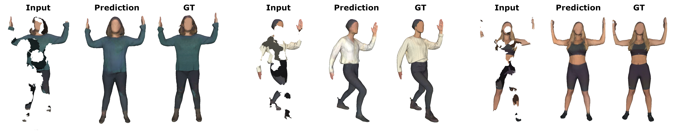

# Implict Feature Networks (IF-Nets) - Texture Extention
> Implicit Feature Networks for Texture Completion from Partial 3D Data <br />
> [Julian Chibane](http://virtualhumans.mpi-inf.mpg.de/people/Chibane.html), [Gerard Pons-Moll](http://virtualhumans.mpi-inf.mpg.de/people/pons-moll.html)



[Paper](https://virtualhumans.mpi-inf.mpg.de/papers/jchibane20ifnet/SHARP2020.pdf) - 
[Project Website](https://virtualhumans.mpi-inf.mpg.de/ifnets/) -
[Arxiv](http://arxiv.org/abs/2009.09458) -
Published in European Conference on Computer Vision (ECCV) Workshops.


#### Citation
If you find our code or paper usful for your project, please consider citing:

    @inproceedings{chibane20ifnet,
        title = {Implicit Functions in Feature Space for 3D Shape Reconstruction and Completion},
        author = {Chibane, Julian and Alldieck, Thiemo and Pons-Moll, Gerard},
        booktitle = {{IEEE} Conference on Computer Vision and Pattern Recognition (CVPR)},
        month = {jun},
        organization = {{IEEE}},
        year = {2020},
    }
and

    @inproceedings{chibane2020ifnet_texture,
        title = {Implicit Feature Networks for Texture Completion from Partial 3D Data},
        author = {Chibane, Julian and Pons-Moll, Gerard},
        booktitle = {European Conference on Computer Vision (ECCV) Workshops},
        month = {August},
        organization = {{Springer}},
        year = {2020},
    }

## Install

A linux system with cuda 9.0 or above is required for the project.

Please clone the repository and navigate into it in your terminal, its location is assumed for all subsequent commands.

The `if-net_env.yml` file contains necessary python dependencies for the project.
To conveniently install them automatically with [anaconda](https://www.anaconda.com/) you can use:
```
conda env create -f if-net_env.yml
conda activate tex_if-net
```

Install the library of the [workshop](https://gitlab.uni.lu/cvi2/eccv2020-sharp-workshop/) with :
```
cd data_processing/eccv2020-sharp-workshop
pip install -r requirements.txt
pip install .
cd ../..
```

## Data Preparation

Please [download](https://cvi2.uni.lu/sharp2020/registration/) and unzip the data of Challange 1 Track 1 into `dataset/SHARP2020/` such that the data is stored as `dataset/SHARP2020/challenge1-track1/{test,train}/File_ID/Files`.

For each human scan we create 4 different, random incomplete ones with

`python -m sharp shoot_dir dataset/SHARP2020/challenge1-track1 dataset/SHARP2020/challenge1-track1 --n-shapes 4`

and convert everything to `.obj`-Format

`python data_processing/convert_to_obj.py`.

We sample points on the full colored surface, extract the corresponding RGB color and save it as training data with

`python data_processing/sample_RGB_GT.py config/SHARP2020/track1.yaml`.

Next, we create the input for the IF-Net (a colored, incomplete shape and a complete but uncolored shape) with

`python data_processing/sample_voxelized_colored_pointcloud.py config/SHARP2020/track1.yaml`.

A data split into training, test and validation is created with

`python data_processing/create_split.py config/SHARP2020/track1.yaml`.

## Pretrained Model
A pretrained model can be found [here](https://nextcloud.mpi-klsb.mpg.de/index.php/s/xPTb4oHb83Txi2W).


## Training and Generation

A model is trained to predict the correct color of a surface point given colored, partial human and ground truth (complete), uncolored human. Use

`python train.py config/SHARP2020/track1.yaml`

to train until convergence. Generation on held out test data is done with

`python generate.py config/SHARP2020/track1.yaml`

automatically using the best model (lowest validation error).

You can also alter the generation code to change the ground truth (complete), uncolored human input to a surface reconstruction.
We used a standard [IF-Net](https://virtualhumans.mpi-inf.mpg.de/ifnets/) for surface reconstruction.

## Contact

For questions and comments regarding the code please contact [Julian Chibane](http://virtualhumans.mpi-inf.mpg.de/people/Chibane.html) via mail.

## License
Copyright (c) 2020 Julian Chibane, Max-Planck-Gesellschaft

Please read carefully the following terms and conditions and any accompanying documentation before you download and/or use this software and associated documentation files (the "Software").

The authors hereby grant you a non-exclusive, non-transferable, free of charge right to copy, modify, merge, publish, distribute, and sublicense the Software for the sole purpose of performing non-commercial scientific research, non-commercial education, or non-commercial artistic projects.

Any other use, in particular any use for commercial purposes, is prohibited. This includes, without limitation, incorporation in a commercial product, use in a commercial service, or production of other artefacts for commercial purposes.
For commercial inquiries, please see above contact information.

THE SOFTWARE IS PROVIDED "AS IS", WITHOUT WARRANTY OF ANY KIND, EXPRESS OR IMPLIED, INCLUDING BUT NOT LIMITED TO THE WARRANTIES OF MERCHANTABILITY, FITNESS FOR A PARTICULAR PURPOSE AND NONINFRINGEMENT. IN NO EVENT SHALL THE AUTHORS OR COPYRIGHT HOLDERS BE LIABLE FOR ANY CLAIM, DAMAGES OR OTHER LIABILITY, WHETHER IN AN ACTION OF CONTRACT, TORT OR OTHERWISE, ARISING FROM, OUT OF OR IN CONNECTION WITH THE SOFTWARE OR THE USE OR OTHER DEALINGS IN THE SOFTWARE.

You understand and agree that the authors are under no obligation to provide either maintenance services, update services, notices of latent defects, or corrections of defects with regard to the Software. The authors nevertheless reserve the right to update, modify, or discontinue the Software at any time.

The above copyright notice and this permission notice shall be included in all copies or substantial portions of the Software. You agree to cite the `Implicit Functions in Feature Space for 3D Shape Reconstruction and Completion` and `Implicit Feature Networks for Texture Completion from Partial 3D Data` papers in documents and papers that report on research using this Software.
